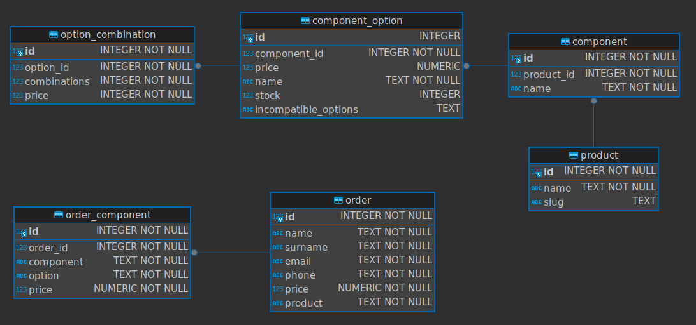
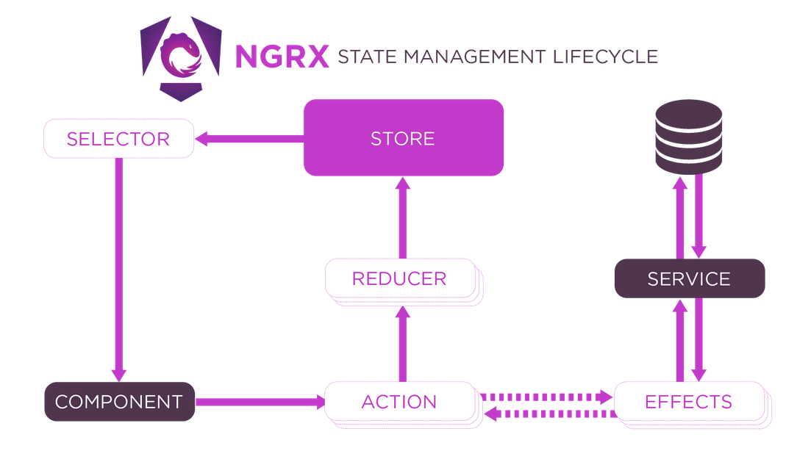
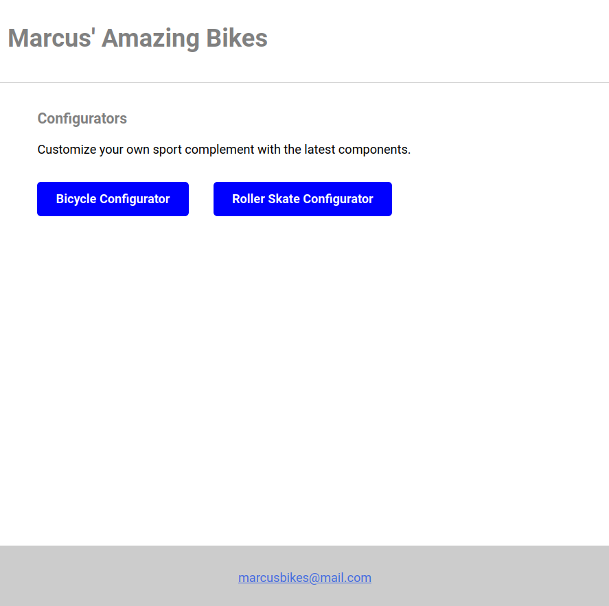
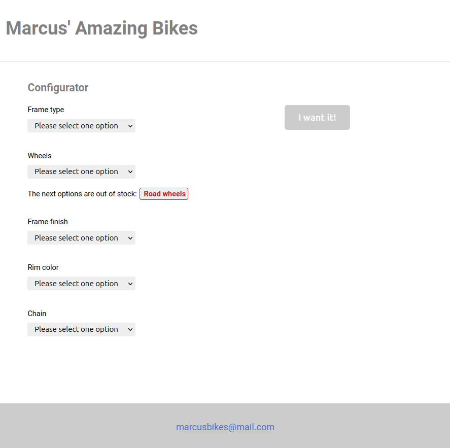
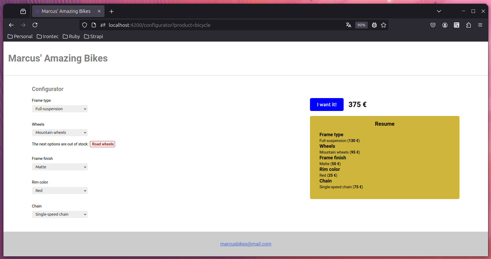
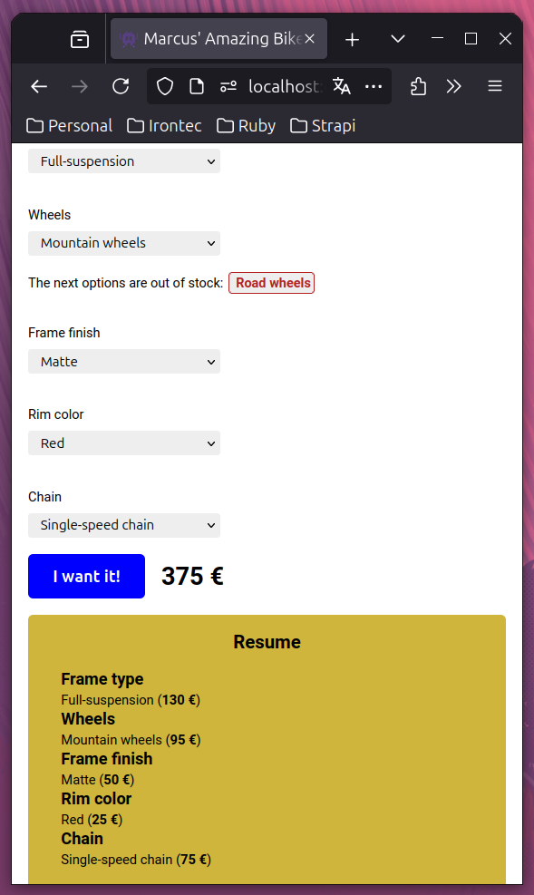

# Factorial

Descripción de la prueba técnica, basada en el enunciado del ejercicio de prueba **tienda de bicicletas**.

## Requisitos

Para la ejecución en local de esta aplicación será necesaria la versión **v20.11.1** de Node.

El proceso de instalación de dependencias con *npm* se podrá realizar ejecutando los siguientes comandos:

```sh
nvm use
npm ci
```

## Comandos de ejecución

Lanzar la ejecución de la api:

```sh
npx nx serve bicycles-api
```

Con este comando se levantará la api, consistente en Node.js + Express

Lanzar la aplicación web:

```sh
npx nx build bicycles-web
```

Con este comando se levantará la aplicación web

Lanzar las pruebas de la api:

```sh
npx nx e2e bicycles-api-e2e
```

## Modelo de datos

El modelo de la base de datos es el siguiente:



### product

Producto configurable y del que la tienda permite crear pedidos en base a una configuración definida por el usuario.

### component

Componente del producto que podrá ser configurado en el pedido final.

- **product_id** - Identificador del producto asociado al componente.

### component_option

Será una de las posibles opciones que puede configurarse para un componente.

- **component_id** - Identificador del componente asociado a la opción.

-**price** - Precio de la opción al margen de posibles combinaciones con otras.

- **stock** - Número de unidades disponibles. En caso de ser NULL se considerará que el stock es ilimitado.

- **incompatible_options** - Array de enteros con los identificadores de las opciones que no podrán combinarse con ella.

### option_combination

Utilizado en caso de que el precio de un producto resulte de su combinación con otros.

- **option_id** - Determina la opción cuyo precio puede variar.
- **combinations** - Será un array de enteros con identificadores de otras opciones.
- **price** - Será el precio de la opción identificada mediante *option_id* fruto de su combinación con las opciones identificadas en *combinations*.

### order

Representa un pedido realizado por el usuario.

- **price** - Precio del pedido calculado internamente una vez recibida la petición de alta de un pedido en base a las opciones seleccionadas. Este campo no puede ser calculado dinámicamente a posteriori ya que los precios de las opciones pueden variar.

- **product** - Nombre del producto. Quedará registrado su nombre y no vinculado mediante un identificador para mantener la referencia en caso de que el producto se elimine de la base de datos.

### order_component

Representa la configuración seleccionada para cada componente del producto.

- **order_id** - Asocia cada registro con el pedido principal al que corresponde.

- **component** - Nombre del componente. Quedará registrado su nombre por las mismas razones comentadas anteriormente.

- **option** - Nombre de la opción seleccionada. Quedará registrado su nombre por las mismas razones comentadas anteriormente.

- **price** - Precio de la opción calculado internamente una vez recibida la petición de alta de un pedido en base a las opciones seleccionadas. Este campo no puede ser calculado dinámicamente a posteriori ya que los precios de las opciones pueden variar.

## Arquitectura

La arquitectura sigue las convenciones del desarrollo en [monorepo de NX](https://nx.dev/concepts/decisions/why-monorepos).

Dentro de esta arquitectura se han creado dos aplicaciones principales.

- **API** - El código de este módulo se encuentra en *apps/bicycles-api*. Se encarga de gestionar las peticiones al backend.
- **Aplicación web** - El código de este módulo se encuentra en *apps/bicycles-we*. Proporciona una interfaz al usuario para que pueda interactuar con la aplicación.

Siguiendo estas convenciones, el código de la aplicación web se encuentra en la carpeta *libs/bicycles-web*, permitiendo en caso de necesidad compartir estos componentes entre distintas aplicaciones.

Dentro de esta carpeta se pueden encontrar los siguientes directorios:

- **feature-checkout** - Módulo que atiende el flujo de un pedido.
- **feature-configurator** - Módulo que atiende el flujo de configuración de un producto.
- **feature-store** - Módulo que atiende la página principal y el resto de secciones de haberlas.

Cada uno de estos directorios atiende un flujo de ejecución concreta y sus distintos casos de uso, tanto el caso de éxito como el caso de error.

Estos módulos siguen el siguiente flujo de vida:



Con lo que será habitual dentro de estos directorios ver la estructura:

- **{nombre-de-feature}.module** - Definición del módulo.
- **{nombre-de-feature}-routing.module** - Definición de las rutas del módulo.
- **actions** - Directorio en el que se encuentran las acciones despachadas por los contenedores.
- **components** - Componentes Angular.
- **containers** - Contenedores Angular. Hacen uso de los componentes Angular para componer cada una de las vistas y se encargan de interactuar con el Store a través de las acciones.
- **effects** - Interactuan con los servicios en función de las acciones despachadas y responden por medio del lanzamiento de nuevas acciones.
- **reducers** - Modifican el Store en función de las acciones despachadas.
- **selectors** - Obtienen datos del Store realizando las trandformaciones oportunas de ser necesario.
- **services** - Servicios que interactuan con los elementos externos de la aplicación web, en este caso la API.

Además de todo ésto, la carpeta *libs/ui.layout* proporciona un layout común a todos los módulos.

## API

### Postman

Se adjunta un [proyecto postman](./doc/postman.json) con la descripción de cada petición.

### Descripcicón

- **GET http://localhost:8888/api/store/products** - Obtiene todos los productos configurables, los cuales se encuentran almacenados en la tabla *product*. Estos productos generarán un enlace en la pantalla inicial hacia el configurador correspondiente:



- **GET http://localhost:8888/api/configurator/options?product=bicycle** - Obtiene las opciones de configuración de un producto en concreto a partir de su slug recibido mediante query param. Estas opciones se mostrarán en la pantalla del configurador:



- **POST http://localhost:8888/api/order/checkout** - Crea un nuevo pedido en base a las opciones seleccionadas por el usuario. Realiza de forma interna todas las operaciones y validaciones que se hacen en la aplicación web (comprobación de stock, incompatibilidad de elementos seleccionados, cálculo de precios...) de forma independiente haciendo uso del modelo común de entidades.

## Aplicación web

La aplicación web se ha desarrollado utilizando Angular + NgRx para poder aplicar los fundamentos Redux.

La maquetación, realizada mediante SCSS, responde adecuadamente a todo tipo de tamaños de pantalla:

Tanto a tamaños grandes:



Como a tamaños pequeños:



## Prueba técnica - Enunciado

You're tasked with building a website that allows Marcus, a bicycle shop owner, to sell his bicycles.

Marcus owns a growing business and now wants to sell via the internet. He also tells you that bicycles are his main product, but if the business continues to grow, he will surely start selling other sports-related items such as skis, surfboards, roller skates, etc. It would be a nice bonus if the same website allowed him to sell those things as well.

What makes Marcus's business successful is that customers can completely customize their bicycles. They can select many different options for the various parts of the bicycle. Here is an incomplete list of all the parts and their possible choices, to give an example:

- Frame type: Full-suspension, diamond, step-through
- Frame finish: Matte, shiny
- Wheels: Road wheels, mountain wheels, fat bike wheels
- Rim color: Red, black, blue
- Chain: Single-speed chain, 8-speed chain

On top of that, Marcus points out that there are some combinations that are prohibited because they are not possible in reality. For example:

- If you select "mountain wheels", then the only frame available is the full suspension.
- If you select "fat bike wheels", then the red rim color is unavailable because the manufacturer doesn't provide it.

Also, sometimes Marcus doesn't have all the possible variations of each part in stock, so he also wants to be able to mark them as "temporarily out of stock" to avoid incoming orders that he would not be able to fulfill.

Finally, Marcus tells you how to calculate the price that you should present to the customer after the customization of the bicycle. Normally, this price is calculated by adding up the individual prices of each part that you selected. For example:

```
Full suspension = 130 EUR
Shiny frame = 30 EUR
Road wheels = 80 EUR
Rim color blue = 20 EUR
Chain: Single-speed chain = 43 EUR

Total price: 130 + 30 + 80 + 20 + 43 = 303 EUR
```

However, the price of some options might depend on others. For instance, the frame finish is applied at the end over the whole bicycle, so the more area to cover, the more expensive it gets. Because of that, the matte finish over a full-suspension frame costs 50 EUR, while applied over a diamond frame it costs 35 EUR.

These kinds of variations can always happen and they might depend on any of the other choices (not only two), so Marcus asks you to consider this because otherwise, he would be losing money.

This code exercise consists of defining a software architecture that could satisfy the requirements described above. In particular:

- *Data model*: What data model would be best to support this application? Could you describe it? Include table specifications (or documents if it's a non-relational database) with fields, their associations, and the meaning of each entity.
- The description of the main user actions in this e-commerce website. Explain how they would work in detail.
- *The product page*: This would be a read operation, performed when you need to display the page of a product (a bicycle) for the customer to purchase. How would you present this UI? How would you calculate which options are available or not? How would you calculate the price depending on the customer's selections?
- The "add to cart" action: Following the previous point, the product page should have a button to "add to cart" after the customer has made some specific selection. What happens when the customer clicks this button? What is persisted in the database?
- The description of the main workflows from the administration part of the website, where Marcus configures the store.
- The creation of a new product: What information is required to create a new product? What changes in the database after performing this action?
- The addition of a new part choice: How can Marcus introduce a new rim color, for example? Can you describe the UI? What changes in the database after this action?
- Setting up prices: How can Marcus change the price of a specific part (like the diamond frame type) or specify that some combinations of choices have particular prices? How does the UI look? How does the database change to store this information?

We expect you to provide the main core model of the solution: a set of classes/functions/modules in the language of your choice that can describe the main relationships between entities and any supporting materials you find useful (database schemas, diagrams, etc). Please make it as lightweight as possible: no need to use web frameworks or provide the finished solution, the goal is to see how you model and code the domain logic.

For any other specification of the system that's not directly stated in the exercise, feel free to interpret it as you see best.